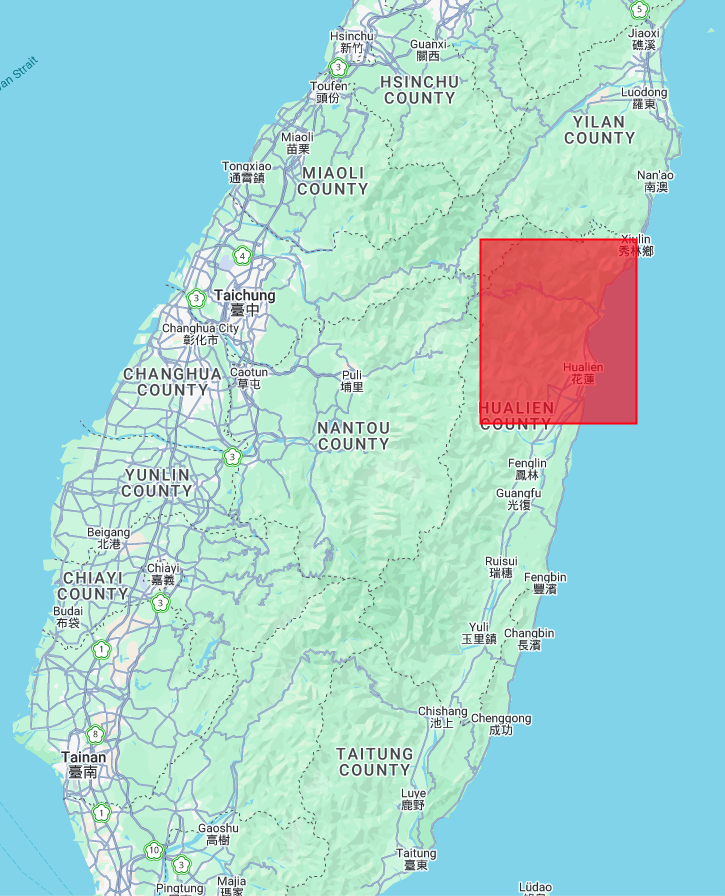
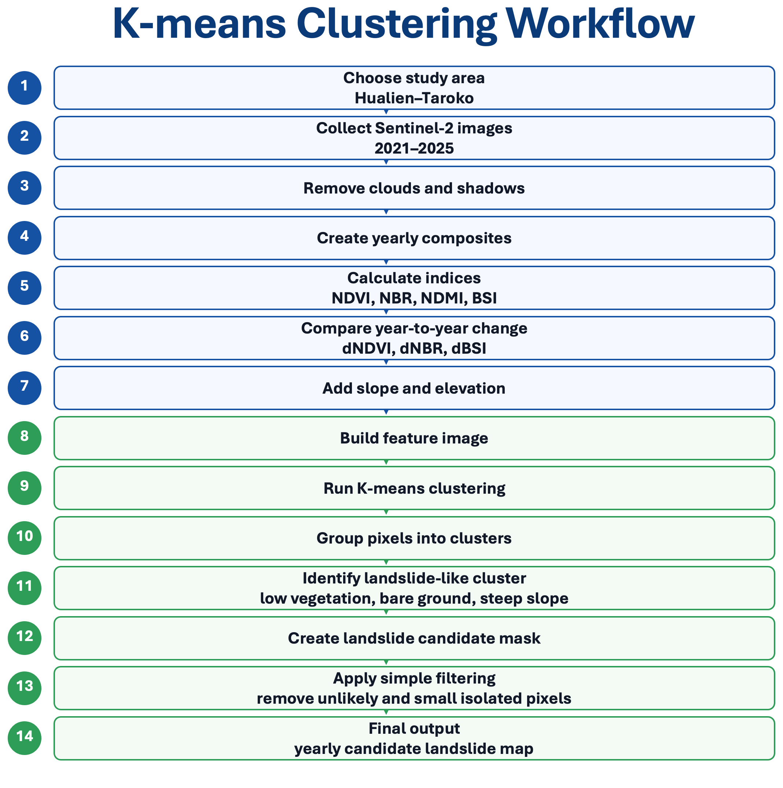
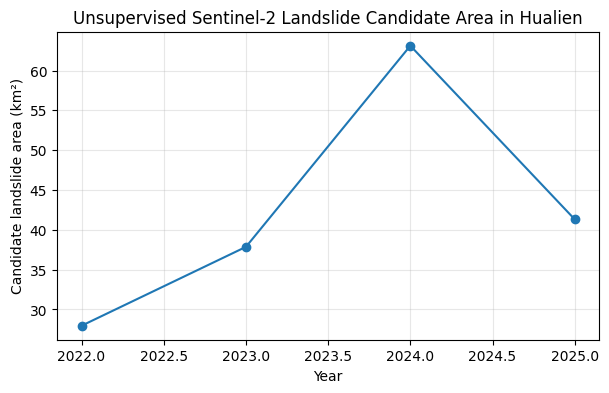
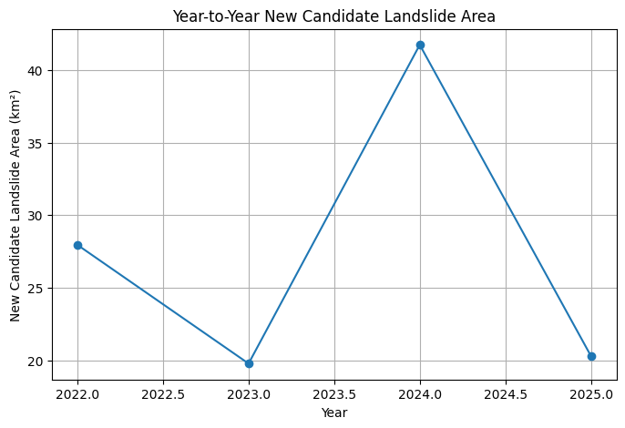

# Landslide Detection Using Unsupervised Classification
### A Case Study in Taroko, Hualien, Taiwan (2021–2025)

## Introduction

This project applies unsupervised machine learning and Sentinel-2 satellite imagery to identify potential landslide areas in Taroko, eastern Taiwan between 2021 and 2025. The study aims to investigate how surface conditions changed before and after the 2024 Hualien earthquake, with particular focus on earthquake-triggered landslides and newly exposed bare ground.

Using Google Earth Engine and K-means clustering, the workflow analyses yearly satellite composites and spectral indices such as NDVI, NBR, NDMI and BSI to automatically classify landslide candidate areas without requiring manually labelled training data. The project demonstrates how freely available satellite imagery and cloud-based geospatial analysis can support rapid environmental assessment in mountainous hazard-prone regions.

Figure 1: Area of Interest (red polygon)     

---

**Problem Statement**

Landslides are a major natural hazard in Taiwan due to steep mountainous terrain, frequent typhoons and active tectonic activity. Following the 3 April 2024 Hualien earthquake, large areas of slope failure and exposed bare ground were observed across the Taroko region. Rapid identification of these landslide-affected areas is important for hazard assessment, infrastructure monitoring and environmental management.

Traditional field-based landslide mapping can be time-consuming, expensive and difficult in remote mountainous terrain. This project therefore investigates whether freely available Sentinel-2 satellite imagery and unsupervised machine-learning techniques can automatically detect potential landslide areas without requiring manually labelled training data.

Using Google Earth Engine and K-means clustering, the project analyses annual satellite composites from 2021–2025 to identify landscape disturbance, vegetation loss and newly exposed ground associated with possible landslide activity before and after the 2024 Hualien earthquake.

## Background

**Why This Topic?**

Taiwan is one of the most landslide-prone regions in the world due to its steep mountainous terrain, active tectonic setting, intense rainfall and frequent typhoons (Lin et al., 2004). Earthquakes can destabilise hillslopes, trigger rockfalls and increase sediment transport, causing widespread geomorphic change across mountain. The Taroko region of eastern Taiwan is characterised by steep relief, narrow valleys and highly fractured metamorphic rocks (Kuo and Brierley, 2013). Combined with intense rainfall from typhoons and frequent seismic activity, these conditions make the region highly susceptible to landslides and debris flows.

The 3 April 2024 Hualien earthquake (Mw 7.4) generated extensive slope failures across eastern Taiwan, particularly within and around Taroko National Park. Detecting these changes rapidly is important for hazard assessment, infrastructure monitoring and environmental management.

Remote sensing provides an effective way to monitor landslide activity over large areas where field surveys may be difficult or dangerous. This project therefore explores whether unsupervised classification of Sentinel-2 imagery can identify likely landslide areas and quantify landscape change through time.

---

**Sentinel-2 Satellite Data**

This project uses Sentinel-2 Level-2A surface reflectance imagery from the European Space Agency’s Copernicus programme. Sentinel-2 is a multispectral Earth-observation mission designed for high-resolution land monitoring. The satellite carries a MultiSpectral Instrument (MSI), which records reflected sunlight from the Earth’s surface in visible, near-infrared and shortwave-infrared wavelengths. These wavelengths are useful because different land surfaces, such as vegetation, bare soil, water and rock, reflect light differently. Sentinel-2 provides 13 spectral bands with spatial resolutions of 10 m, 20 m and 60 m, a 290 km swath width and a revisit time of about 5 days, making it suitable for monitoring rapid landscape changes such as landslides after earthquakes or typhoons (Drusch et al., 2012)

In this project, annual Sentinel-2 composites are created for each year from 2021 to 2025. Cloud and shadow pixels are masked before calculating spectral indices. These indices help highlight vegetation loss, exposed bare soil, surface moisture and landscape disturbance, which are important indicators of possible landslide scars.

Key spectral indices used in this project include:

| Index | Purpose | Bands | 
|---|---|---|
| NDVI | Vegetation condition | (B8 - B4) / (B8 + B4) (Sentinel Hub, n.d) | 
| NBR | Vegetation disturbance / bare ground | (B8 - B12) / (B8 + B12) (Sentinel Hub, n.d) |
| NDMI | Surface moisture | (B8 - B11) / (B8 + B11) (Gao, 1996)|
| BSI | Bare soil exposure | ((B11 + B4) - (B8 + B2)) / ((B11 + B4) + (B8 + B2)) (Nguyen et al., 2021) |

Figure 2: Overview of the Sentinel-2

---

**k means clustering for unsupervised learning**

K-means clustering is an unsupervised machine-learning method that groups data into a chosen number of clusters based on similarity. It works by assigning each data point to the nearest cluster centre, then repeatedly updating the cluster centres until the groups become stable (MacQueen, 1967). Because it does not require labelled training data, K-means is useful when the exact land-cover classes are unknown. 

In this project, K-means clustering is applied to Sentinel-2 spectral indices, including NDVI, NBR, NDMI and BSI, together with topographic information such as slope and elevation. Pixels with similar spectral and terrain characteristics are grouped into clusters, and clusters showing low vegetation, low moisture and high bare-soil signals are interpreted as possible landslide or newly exposed ground areas. 

Figure 3: Workflow of the K-means unsupervised classification approach used for landslide candidate detection from Sentinel-2 imagery and topographic data

## Getting Started

1. Download the .ipynb notebook from this repository
2. Upload the notebook to Google Colab or run locally using Jupyter Notebook
3. Authenticate Google Earth Engine
5. Run all cells

## How the Notebook Works

This notebook detects and maps potential landslide areas in the Taroko region using Sentinel-2 satellite imagery, spectral indices, topographic data, and annual change detection. The workflow compares conditions from 2021 to 2025 to identify both existing landslide candidates and newly developed landslide candidates, especially after the 2024 Hualien earthquake.

**1. Study Area Definition**

The notebook first defines the study area around Taroko, Hualien, Taiwan. This area is selected because it contains steep mountainous terrain where earthquake-triggered landslides are likely to occur.

The Area of Interest (AOI) is used to clip all satellite images, topographic layers, classification outputs, and exported results.

**2. Sentinel-2 Image Collection**

Sentinel-2 surface reflectance imagery is loaded for each target year from 2021 to 2025. The notebook filters the image collection by:

- Study area
- Date range
- Cloud percentage
- Required spectral bands

Cloud masking is then applied to reduce the influence of clouds and cloud shadows. A median composite image is created for each year to represent the general surface condition during that period.

**3. RGB Visualisation**

For each year, the notebook generates RGB images using Sentinel-2 visible bands. These RGB images are used to visually compare surface changes through time.

They help show where bare ground, vegetation loss, exposed slopes, and possible landslide scars appear in the landscape.

**4. Spectral Index Calculation**

Several spectral indices are calculated from the Sentinel-2 bands to highlight landslide-related surface characteristics:

- **NDVI**: identifies vegetation condition
- **NBR**: highlights vegetation disturbance and exposed surfaces
- **NDMI**: represents surface moisture conditions
- **BSI**: highlights bare soil and exposed ground
- **dNDVI / dNBR / dBSI**: measure change compared with the reference year

Landslides are expected to show low vegetation indices and high bare-soil values because vegetation is often removed and fresh rock or soil becomes exposed.

**5. Topographic Data Processing**

The notebook also adds topographic information, including:

- Elevation
- Slope

This is important because landslides are more likely to occur on steep terrain. By combining spectral and topographic information, the workflow can better separate possible landslides from flat bare areas such as riverbeds, roads, or urban surfaces.

**6. Feature Image Creation**

For each year, the notebook combines the spectral indices and topographic layers into a multi-band feature image. These feature images are used as input for landslide candidate detection.

Each pixel contains information about vegetation, bare ground, moisture, slope, elevation, and annual change.

**7. Landslide Candidate Detection**

The notebook identifies landslide candidate pixels based on their spectral and topographic characteristics. Areas are more likely to be classified as landslide candidates when they show:

- Low vegetation cover
- High bare soil exposure
- Strong negative vegetation change
- Steep slope
- Mountainous terrain

The output for each year is a binary landslide mask:

- `1` = landslide candidate
- `0` = non-landslide area

**8. New Landslide Candidate Detection**

The notebook also calculates **new landslide candidates** by comparing each year with the previous year or baseline condition.

This helps distinguish areas that were already bare or disturbed from areas that newly appeared as potential landslides. For example, if a pixel is classified as a landslide candidate in 2024 but was not classified as one in 2023, it can be counted as a new candidate area.

This is useful for identifying changes after major triggering events such as the 2024 Hualien earthquake.

**9. Annual Area Calculation**

The notebook calculates the total area of landslide candidates for each year. It also calculates the area of new landslide candidates.

These values are summarised in charts to show how landslide candidate area changes from 2021 to 2025.

The results show an increase in landslide candidate area after the 2024 Hualien earthquake, especially in steep mountainous terrain.

**10. Map Visualisation**

The notebook produces several map outputs for each year:

- RGB satellite image
- Landslide candidates overlaid on RGB imagery
- Binary landslide mask
- New landslide candidate mask

These visualisations make it easier to compare annual changes and identify where landslide activity may have increased.

**11. Exporting Results**

The final section exports the results for further use. 

## Results

The figure below shows the results from 2021 to 2025. The first row presents the Sentinel-2 RGB composites, the second row shows the detected landslide candidates overlaid on the RGB images, and the third row presents the binary landslide masks. The workflow successfully identified areas with strong spectral and topographic characteristics consistent with landslide activity. These areas are mainly located on steep mountainous slopes. An increase in landslide candidate area was observed after the 2024 Hualien earthquake, suggesting that the earthquake had a significant impact on slope instability and landslide occurrence in the study area. Moreover, in the 2024 RGB image, many landslides can be directly observed. However, because this method is unsupervised, the mapped areas should be interpreted as landslide candidates rather than confirmed landslides.

Figure 4: Annual Sentinel-2 RGB composites (top row), landslide candidate overlays (middle row), and binary landslide masks (bottom row) for 2021–2025 in the Taroko study area. Increased landslide activity and exposed bare ground are visible after the 2024 Hualien earthquake.

The two charts show the total landslide candidate area and the newly detected landslide candidate area for each year. The total candidate area represents all pixels classified as potential landslides in a given year, whilst the new candidate area represents locations that were detected in the current year but were not identified in the previous year. The new candidate analysis is important because it highlights newly developed or recently exposed landslide features, rather than areas that remained persistently bare or unstable across multiple years. This helps distinguish recent slope failures, particularly those triggered by extreme events such as the 2024 Hualien earthquake, from older pre-existing landslide scars or long-term exposed surfaces.

  

  <em>Figure 5: Total annual landslide candidate area detected between 2021 and 2025.</em>

 

  

  <em>Figure 6: Newly detected landslide candidate area for each year from 2021 to 2025, highlighting areas of recent surface disturbance and potential earthquake-triggered slope failure.</em>

 

&emsp;&emsp;The unsupervised approach provides a rapid and scalable method for preliminary landslide detection using freely available satellite imagery. However, further validation using official landslide inventories or high-resolution imagery would be required for operational hazard assessment.
## Environmental Cost

This project considers the environmental cost of cloud-based remote-sensing analysis. Although the workflow uses Google Earth Engine and Google Colab, its computational footprint is expected to be low because it applies K-means clustering rather than heavy deep-learning training. In the notebook, K-means is run with **8 clusters** and about **15,984 sampled pixels** after cloud masking.

The table below gives an approximate estimate for one full notebook run, **20 W** power use, **0.18 kg CO₂e/kWh**, and **£0.30/kWh** electricity cost. Actual values may vary depending on runtime, hardware and cloud-server location.

| Stage | Runtime | Energy (kWh) | CO₂e (g) | Cost (£) |
|---|---:|---:|---:|---:|
| Image loading and cloud masking | 12 min | 0.0024 | 0.43 | 0.0007 |
| Spectral index processing | 8 min | 0.0016 | 0.29 | 0.0005 |
| K-means clustering | 5 min | 0.0010 | 0.18 | 0.0003 |
| Masking, area calculation and visualisation | 25 min | 0.0050 | 0.90 | 0.0015 |
| **Total** | **50 min** | **0.0100** | **1.80** | **0.0030** |

Overall, the emissions from this analysis are very small. A satellite-based workflow can also reduce the need for repeated field visits to remote or hazardous landslide areas. However, this estimate only covers the approximate notebook runtime and does not fully include Google Earth Engine server-side processing, satellite operation.

## References
- Drusch, M., Del Bello, U., Carlier, S., Colin, O., Fernandez, V., Gascon, F., Hoersch, B., Isola, C., Laberinti, P., Martimort, P., Meygret, A., Spoto, F., Sy, O., Marchese, F., & Bargellini, P. (2012). Sentinel-2: ESA’s optical high-resolution mission for GMES operational services. Remote Sensing of Environment, 120, 25-36. https://doi.org/10.1016/j.rse.2011.11.026
- Gao, B.-C. (1996). NDWI—A normalized difference water index for remote sensing of vegetation liquid water from space. Remote Sensing of Environment, 58(3), 257–266. https://doi.org/10.1016/S0034-4257(96)00067-3
- Kuo, C.-W., Brierley, G. (2013). The influence of landscape configuration upon patterns of sediment storage in a highly connected river system. Geomorphology, 180-181, 255–266. 10.1016/j.geomorph.2012.10.015
- Lin, G.-W., Chen, H., Hovius, N., Horng, M.-J., Dadson, S., Meunier, P., & Lines, M. (2008). Effects of earthquake and cyclone sequencing on landsliding and fluvial sediment transfer in a mountain catchment. Earth Surface Processes and Landforms, 33(9), 1354-1373. https://doi.org/10.1002/esp.1716
- MacQueen, J. (1967). Some methods for classification and analysis of multivariate observations. In L. M. Le Cam & J. Neyman (Eds.), Proceedings of the Fifth Berkeley Symposium on Mathematical Statistics and Probability (Vol. 1, pp. 281–297). University of California Press.
- Nguyen, C. T., Chidthaisong, A., Kieu Diem, P., & Huo, L.-Z. (2021). A modified bare soil index to identify bare land features during agricultural fallow-period in Southeast Asia using Landsat 8. Land, 10(3), Article 231. https://doi.org/10.3390/land10030231
- Sentinel Hub. (n.d.). Normalized difference vegetation index. Sentinel Hub custom scripts. https://custom-scripts.sentinel-hub.com/custom-scripts/sentinel-2/ndvi/
- Sentinel Hub. (n.d.). NBR-RAW (Normalized Burn Ratio). Sentinel Hub custom scripts. https://custom-scripts.sentinel-hub.com/custom-scripts/sentinel-2/nbr/

